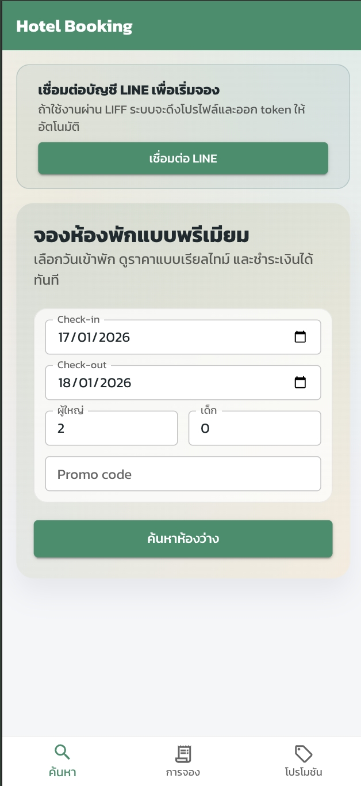
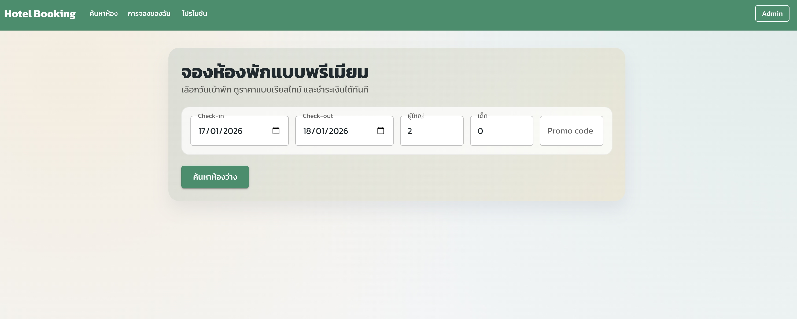
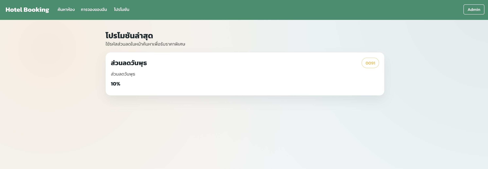
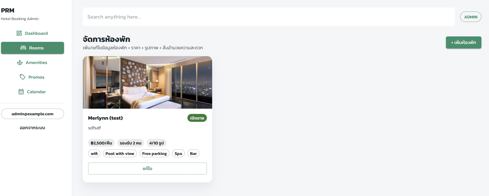
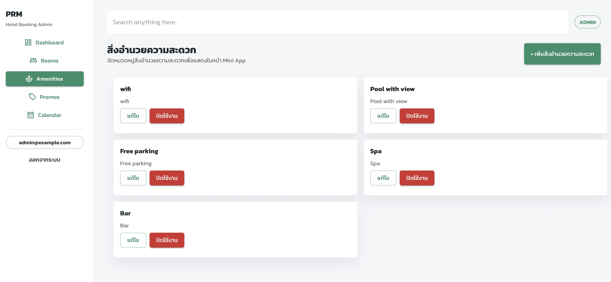
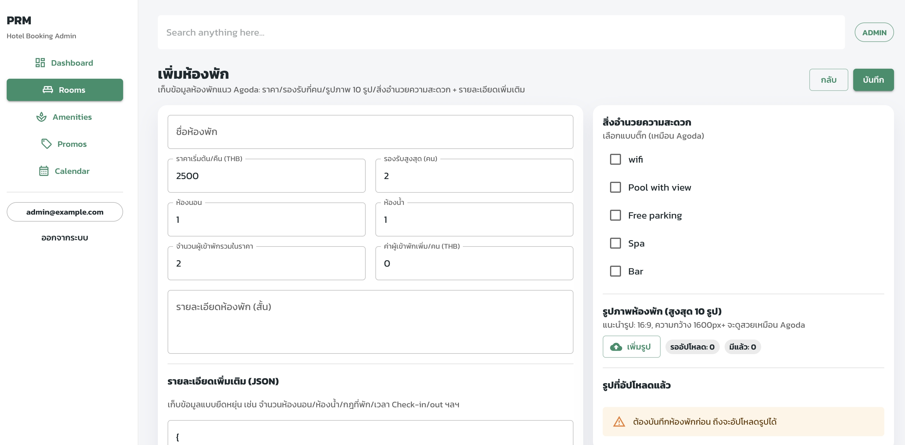
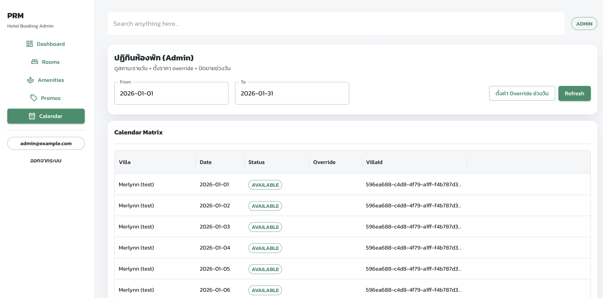

# Webapp (Vite + React + MUI)

## Run
```bash
cp .env.example .env
npm i
npm run dev
```

## Environment
- `VITE_SUPABASE_URL`
- `VITE_SUPABASE_KEY`
- `VITE_SUPABASE_ROOM_IMAGE_BUCKET`
- `VITE_LIFF_ID`

## Line user
- ให้เชื่อมต่อ LINE ผ่านปุ่มใน UI (LIFF) เพื่อเก็บ `lineUserId` ใน localStorage

## Admin
- ไปที่ `/admin/login`
- เข้าระบบด้วยอีเมล/พาสเวิร์ด (RPC: `admin_login`)

## LIFF
- ตั้งค่า `VITE_LIFF_ID` เพื่อให้ปุ่ม “เชื่อมต่อ LINE” ทำงานใน mini app


ตัวอย่าง 

<p align="center">
  
</p>
 <p align="center">
  
</p>
<p align="center">
  
</p>
<p align="center">
  
</p>
<p align="center">
  
</p>
<p align="center">
  
</p>
<p align="center">
  
</p>